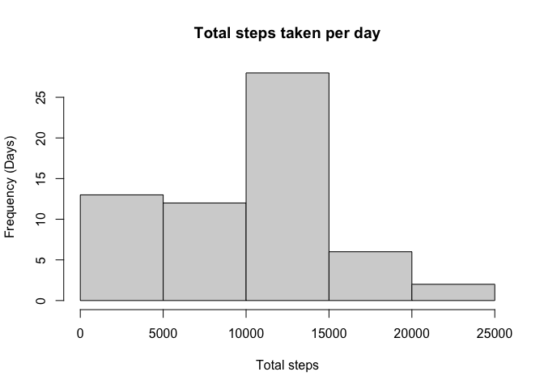
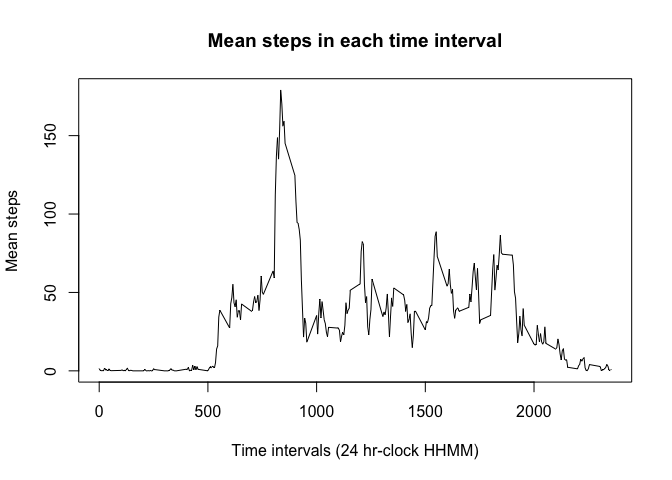
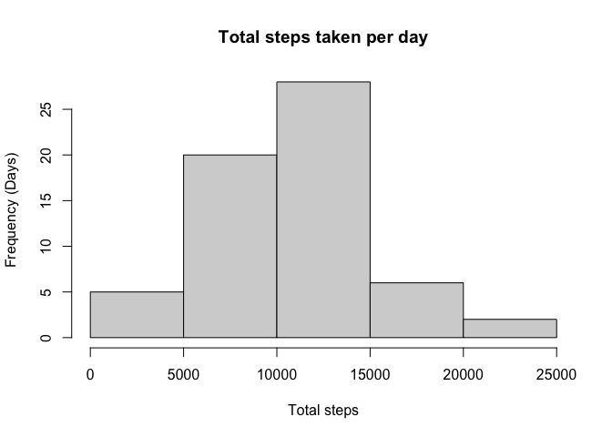
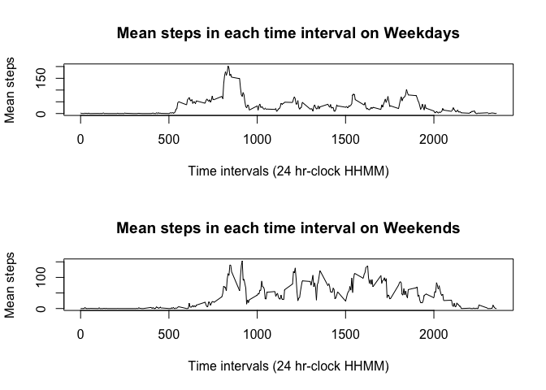

## Loading and preprocessing the data  


Use unz to extract activity.csv from compressed .zip, read in as a data frame

```r
activityData <- read.csv(unz("activity.zip", filename = "activity.csv"), header = TRUE)
summary(activityData)
```

```
##      steps            date              interval     
##  Min.   :  0.00   Length:17568       Min.   :   0.0  
##  1st Qu.:  0.00   Class :character   1st Qu.: 588.8  
##  Median :  0.00   Mode  :character   Median :1177.5  
##  Mean   : 37.38                      Mean   :1177.5  
##  3rd Qu.: 12.00                      3rd Qu.:1766.2  
##  Max.   :806.00                      Max.   :2355.0  
##  NA's   :2304
```
The summary shows a large number of NA's but they'll be dealt with later on 

## What is mean total number of steps taken per day?

```r
# scoop up all the dates
dates <- unique(activityData$date)

# calculate totals in a vector parallel to dates
totals <- numeric()
for(i in 1:length(dates)) {
  totals <- c(totals, 
             sum(activityData[activityData$date==dates[i],1], na.rm = TRUE))
}

# histogram of totals
hist(totals,
     main = "Total steps taken per day",
     xlab = "Total steps",
     ylab = "Frequency (Days)")
```

<!-- -->

```r
# final calculations
meanTotal <- mean(totals)
medianTotal <- median(totals)
```

na.rm set to TRUE to remove all NA values from mean calculation 

The mean of total steps per day is 9354.2295082 steps  

The median of total steps per day is 1.0395\times 10^{4} steps  

## What is the average daily activity pattern?

```r
## Calculate total steps at each time interval across every day 

# collect every time interval value 
intervals <- unique(activityData$interval)

# calculate totals in a vector parallel to intervals
totalIntSteps <- numeric()
for(i in 1:length(intervals)) {
  totalIntSteps <- c(totalIntSteps, 
                    sum(activityData[activityData$interval==intervals[i],1], 
                    na.rm = TRUE))
}

# divide every sum by the total number of days
# mean for that interval over every day 
meanIntSteps <- totalIntSteps/length(dates)

# plot mean steps over all intervals
plot(intervals, meanIntSteps, 
     type="l",
     main = "Mean steps in each time interval",
     xlab = "Time intervals (24 hr-clock HHMM)",
     ylab = "Mean steps")
```

<!-- -->

```r
# find peak activity time (intervals vector @ index of max steps)
resTime <- intervals[which.max(meanIntSteps)]
resTime
```

```
## [1] 835
```
Peak activity time is observed around the interval 835  

## Imputing missing values  
All NA's will be replaced with mean steps for that time interval 

```r
# copy the data into a new DF for editing
newData <- activityData
# loop through all NA's
for(i in 1:nrow(activityData)) {
  # replace NA's with mean steps for the correct time interval
  if(is.na(activityData[i,1])) {
    newData[i,1] <- meanIntSteps[intervals == newData[i,3]]
  }
}


# calculate totals once more (no longer need remove na)
totals <- numeric()
for(i in 1:length(dates)) {
  totals <- c(totals, 
             sum(newData[newData$date==dates[i],1]))
}


# create histogram of totals
hist(totals,
     main = "Total steps taken per day",
     xlab = "Total steps",
     ylab = "Frequency (Days)")
```

<!-- -->

```r
# final calculations
meanTotal <- mean(totals)
medianTotal <- median(totals)
```
The mean of total steps per day is 1.0581014\times 10^{4} steps  

The median of total steps per day is 1.0395\times 10^{4} steps 

The mean value has risen. Replacement of NA's with mean interval value across 
all days resulted in a slightly more normal distribution, specifically this
appears to be due to a greater frequency of days where total steps numbered 
between 5000-10000 (because NA's have been filled in).

## Are there differences in activity patterns between weekdays and weekends?

```r
# create weekday/weekend vectors for identification
weekday <- c("Monday", "Tuesday","Wednesday", "Thursday", "Friday")
weekend <- c("Saturday", "Sunday")

newCol <- numeric()
for(i in 1:length(activityData$date)) {
  # convert current date to Date 
  curDate <- as.Date(activityData$date[i])
  # convert to day of the week, check if weekday or weekend
  if(sum(weekdays(curDate) == weekday) == 1) {
    newCol[i] <- 0
  }  
  else {
    newCol[i] <- 1
  }
}
# newCol

# convert column of 0's and 1's into two levels weekday, weekend
dayType <- factor(newCol, labels = c("Weekday", "Weekend"))

# modify original data set (instead of modified one with imputed vals)
# add a new column determining if weekday or weekend
activityData <- cbind(activityData, dayType)
head(activityData)
```

```
##   steps       date interval dayType
## 1    NA 2012-10-01        0 Weekday
## 2    NA 2012-10-01        5 Weekday
## 3    NA 2012-10-01       10 Weekday
## 4    NA 2012-10-01       15 Weekday
## 5    NA 2012-10-01       20 Weekday
## 6    NA 2012-10-01       25 Weekday
```

```r
## Calculate averages at every time interval for all weekdays/all weekends

# split data in two parts based on weekday/weekend
weekData <- activityData[activityData$dayType=="Weekday",]
endData <- activityData[activityData$dayType=="Weekend",]


# find the total number of weekdays and weekends
numWeekdays <- unique(weekData$date)
numWeekends <- unique(endData$date)


# calculate sums of each 
totalWeekSteps <- numeric(0) 
totalEndSteps <- numeric(0)
for(i in 1:length(intervals)) {
  # sum up the steps at a single interval across every day
  totalWeekSteps <- c(totalWeekSteps, 
              sum(weekData[weekData$interval == intervals[i],1], na.rm = TRUE))
  totalEndSteps <- c(totalEndSteps, 
              sum(endData[endData$interval == intervals[i],1], na.rm = TRUE))
}

# divide each element by total number of weekdays/weekends respectively 
meanWeekSteps <- totalWeekSteps/length(numWeekdays)
meanEndSteps <- totalEndSteps/length(numWeekends)

# plots
par(mfrow = c(2,1))
plot(intervals, meanWeekSteps,
     type="l",
     main = "Mean steps in each time interval on Weekdays",
     xlab = "Time intervals (24 hr-clock HHMM)",
     ylab = "Mean steps")
plot(intervals, meanEndSteps,
     type="l",
     main = "Mean steps in each time interval on Weekends",
     xlab = "Time intervals (24 hr-clock HHMM)",
     ylab = "Mean steps")
```

<!-- -->
